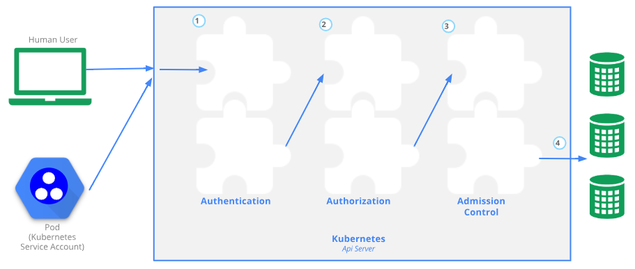

# admission controller原理


APIServer其实最重要的三件事情就是：
- 认证: 用户是否合法
- 授权: 用户拥有哪些权限
- 准入控制: 一个调用链，对请求进行修改或拒绝

> 这个准入控制器是十分有用的，也是kubernetes一种比较常见的扩展方式。现在，我们将详细的介绍一下这个admission controller。

## admission controller支持参数说明
```golang
type AdmissionOptions struct {
	// GenericAdmission holds the generic admission options.
	// 当前版本的plugin注册方式,支持--enable-admission-plugins 和 --disable-admission-plugins参数进行插件的启用和禁用方式
	GenericAdmission *genericoptions.AdmissionOptions
	// DEPRECATED flag, should use EnabledAdmissionPlugins and DisabledAdmissionPlugins.
	// They are mutually exclusive, specify both will lead to an error.
	//为了向下兼容低版本的plugin注册方式，低版本使用admission-control参数来启用哪些插件
	PluginNames []string
}

// NewAdmissionOptions creates a new instance of AdmissionOptions
// Note:
//  In addition it calls RegisterAllAdmissionPlugins to register
//  all kube-apiserver admission plugins.
//
//  Provides the list of RecommendedPluginOrder that holds sane values
//  that can be used by servers that don't care about admission chain.
//  Servers that do care can overwrite/append that field after creation.
func NewAdmissionOptions() *AdmissionOptions {
	options := genericoptions.NewAdmissionOptions()
	// register all admission plugins
	//获取所有的插件信息
	RegisterAllAdmissionPlugins(options.Plugins)
	// set RecommendedPluginOrder
	//对所有的插件进行排序
	options.RecommendedPluginOrder = AllOrderedPlugins
	// set DefaultOffPlugins
	//设置默认的停用插件
	options.DefaultOffPlugins = DefaultOffAdmissionPlugins()

	return &AdmissionOptions{
		GenericAdmission: options,
	}
}

// Validate verifies flags passed to kube-apiserver AdmissionOptions.
// Kube-apiserver verifies PluginNames and then call generic AdmissionOptions.Validate.
// 验证--enable-admission-plugins 、 --disable-admission-plugins 和 admission-control 参数的有效性
func (a *AdmissionOptions) Validate() []error {
	...   //省略具体代码
}

// ApplyTo adds the admission chain to the server configuration.
// Kube-apiserver just call generic AdmissionOptions.ApplyTo.
// 注册admission到etcd中去
func (a *AdmissionOptions) ApplyTo(
	c *server.Config,
	informers informers.SharedInformerFactory,
	kubeAPIServerClientConfig *rest.Config,
	pluginInitializers ...admission.PluginInitializer,
) error {
	...  //省略具体代码
}
```
- AdmissionOptions 是数据结构并同时支持低版本的参数传入
- NewAdmissionOptions 进行插件注册、排序、将默认关闭的插件禁用。
- Validate 对参数--enable-admission-plugins 、 --disable-admission-plugins 和 admission-control 验证有效性。
- ApplyTo把对应的参数配置信息写入到etcd中去

## admission controller插件相关逻辑
### 默认关闭的admission controller
```golang
// 默认关闭的plugin
func DefaultOffAdmissionPlugins() sets.String {
	//定义默认开启的插件
	defaultOnPlugins := sets.NewString(
		lifecycle.PluginName,                //NamespaceLifecycle
		limitranger.PluginName,              //LimitRanger
		serviceaccount.PluginName,           //ServiceAccount
		setdefault.PluginName,               //DefaultStorageClass
		resize.PluginName,                   //PersistentVolumeClaimResize
		defaulttolerationseconds.PluginName, //DefaultTolerationSeconds
		mutatingwebhook.PluginName,          //MutatingAdmissionWebhook
		validatingwebhook.PluginName,        //ValidatingAdmissionWebhook
		resourcequota.PluginName,            //ResourceQuota
	)
	//根据feature是否支持，来决定plugin是否启用
	if utilfeature.DefaultFeatureGate.Enabled(features.PodPriority) {
		defaultOnPlugins.Insert(podpriority.PluginName) //PodPriority
	}
	if utilfeature.DefaultFeatureGate.Enabled(features.TaintNodesByCondition) {
		defaultOnPlugins.Insert(nodetaint.PluginName) //TaintNodesByCondition
	}
	//排除所有的默认开启插件，其余的为默认关闭插件
	return sets.NewString(AllOrderedPlugins...).Difference(defaultOnPlugins)
}
```

- 默认开启的admission controller:

    |  名称  | 作用   | 
    |:----------:|------------|
    | NamespaceLifecycle | 确保处于termination状态的namespace不再接收任何新对象的请求，并拒绝请求不存在的namespace。 | 
    | LimitRanger | 在多租户配额时相当有用，如果pod没配额，那么我可以默认给个很低的配额 |
    | ServiceAccount | 在pod没有设置serviceAccount属性时,将这个pod的sa设置为"default";在安全环境下使用，因为default这个sa的权限是admin权限。| 
    | DefaultStorageClass | 默认存储类型 |
    | PersistentVolumeClaimResize| 检查传入的 PersistentVolumeClaim 调整大小请求，对其执行额外的验证操作。（注意：对调整卷大小的支持是一种 Alpha 特性。管理员必须将特性门控 ExpandPersistentVolumes 设置为 true 才能启用调整大小。）|
    | DefaultTolerationSeconds | 设置POD的默认forgiveness toleration为5分钟。|
    | MutatingAdmissionWebhook | 变更准入控制webhook|
    | ValidatingAdmissionWebhook| 验证准入控制webhook|
    | ResourceQuota | 多租户配额时比较重要，看资源是否满足resource quota中的配置|
    
    > 这里有两个比较特殊的控制器:**MutatingAdmissionWebhook** 和 **ValidatingAdmissionWebhook**。
    > - 这两个控制器将发送准入请求到外部的 HTTP 回调服务并接收一个准入响应。如果启用了这两个准入控制器，Kubernetes 管理员可以在集群中创建和配置一个 admission webhook。

- 根据版本开启的feature
> 而这里需要注意admission controller 需要进行版本判断,目前 **PodPriority**和**TaintNodesByCondition**需要根据不同的版本来判断是否开启这个功能，至于这俩插件的具体功能就不具体赘述了。我们这里主要讲述admission的原理。

    ```golang
    // owner: @bsalamat
    // alpha: v1.8
    // beta: v1.11
    // GA: v1.14
    //
    // Add priority to pods. Priority affects scheduling and preemption of pods.
    PodPriority utilfeature.Feature = "PodPriority"
    
    // owner: @k82cn
    // beta: v1.12
    //
    // Taint nodes based on their condition status for 'NetworkUnavailable',
    // 'MemoryPressure', 'PIDPressure' and 'DiskPressure'.
    TaintNodesByCondition utilfeature.Feature = "TaintNodesByCondition"
```
这里详细说明了具体功能的功能阶段对应的版本号。

- 最后最终处理一下默认关闭的admission
`sets.NewString(AllOrderedPlugins...).Difference(defaultOnPlugins)` 将默认开启的admission排除后为默认关闭的admission。

### 所有支持的admission controller进行注册和排序
```golang
// AllOrderedPlugins is the list of all the plugins in order.
// 对所有的plugins进行一次排序，按照顺序进行加载
var AllOrderedPlugins = []string{
	admit.PluginName,                        // AlwaysAdmit
	...   // 这里省略代码
}

// RegisterAllAdmissionPlugins registers all admission plugins and
// sets the recommended plugins order.
// 注册所有的plugins，只是在代码中注册而已。 手动注册插件
func RegisterAllAdmissionPlugins(plugins *admission.Plugins) {
	admit.Register(plugins) // DEPRECATED as no real meaning
	...   // 这里省略代码
}
```
- **AllOrderedPlugins** 是对所有的插件进行了一次排序
- **RegisterAllAdmissionPlugins** 所有支持的插件在Kubernetes的代码中进行了注册

看到这里我们知道了其实注册admission controller的话跟我们在apiserver中配置的**顺序并无太大的关系**，内部已经定好了加载顺序了。而且如果我们要在kubernetes改动源码来编写对应的admission controller的话
需要我们在这两个函数也注册一下我们的plugin否则kubernetes是不认识的。

## 编写一个自定义的admission controller插件

所有的插件定义都在kubernetes/plugin/pkg/admission。其实是比较简单的。
1. 实现admission controller对应的接口
2. 定义并注册这个插件
3. 在[plugins.go](https://github.com/kubernetes/kubernetes/blob/575467a0eaf3ca1f20eb86215b3bde40a5ae617a/pkg/kubeapiserver/options/plugins.go)中的RegisterAllAdmissionPlugins函数中调用之前写好的注册函数
4. 在[plugins.go](https://github.com/kubernetes/kubernetes/blob/575467a0eaf3ca1f20eb86215b3bde40a5ae617a/pkg/kubeapiserver/options/plugins.go)中的AllOrderedPlugins函数中把写好的插件进行排序

### 实现admission controller对应的接口

```golang
// Interface is an abstract, pluggable interface for Admission Control decisions.
type Interface interface {
	// Handles returns true if this admission controller can handle the given operation
	// where operation can be one of CREATE, UPDATE, DELETE, or CONNECT
	Handles(operation Operation) bool
}

type MutationInterface interface {
	Interface

	// Admit makes an admission decision based on the request attributes
	Admit(a Attributes, o ObjectInterfaces) (err error)
}

// ValidationInterface is an abstract, pluggable interface for Admission Control decisions.
type ValidationInterface interface {
	Interface

	// Validate makes an admission decision based on the request attributes.  It is NOT allowed to mutate
	Validate(a Attributes, o ObjectInterfaces) (err error)
}
```

- Handles函数
主要是告诉kubernetes这个admission是否能处理对应的操作，具体的操作有: CREATE, UPDATE, DELETE, or CONNECT。
  - 如果无需处理则直接返回true即可
  - admission.NewHandler(admission.Create, admission.Update) 可调用公共方法来直接生成方法实现。

- Admit函数
  对kubernetes的资源进行处理或者修改等，比如加个label什么的。 
   
- Validate
  对请求数据的具体属性进行一次验证，比如验证k8s的资源定义是否符合规则等。
  
由于admission controller会在apiserver接收到数据后优先进行Admit函数修改资源后再调用Validate进行验证资源数据属性的合法性。所以这里可以看到
**Validate其实本质上就是Admit的一个验证而已**。

### 定义并注册这个插件
1. 定义插件名

   `const PluginName = "AlwaysPullImages"`
   
1. 声明插件对应的结构体
    ```golang
    type AlwaysPullImages struct {
    	*admission.Handler
    }
    ```
    这里需要注意一下,`*admission.Handler`其实就是之前需要实现的函数**Handles函数**,这里如果无需处理单独直接写也可以的:
    ```goalng
    // Handles returns true if this admission controller can handle the given operation
    // where operation can be one of CREATE, UPDATE, DELETE, or CONNECT
    func (alwaysAdmit) Handles(operation admission.Operation) bool {
    	return true
    }
    ```
    也可以直接在初始化方法的时候调用kubernetes的方法进行初始化:
    ```golang
    // NewAlwaysPullImages creates a new always pull images admission control handler
    func NewAlwaysPullImages() *AlwaysPullImages {
    	return &AlwaysPullImages{
    		Handler: admission.NewHandler(admission.Create, admission.Update),
    	}
    }
    var _ admission.MutationInterface = &AlwaysPullImages{}
    var _ admission.ValidationInterface = &AlwaysPullImages{}
    ```
    这里需要注意需要定义对应admission所实现的接口到当前结构，否则注册时候无法注册到admission中去。如下代码:
    ```golang
    var _ admission.MutationInterface = &AlwaysPullImages{}
    var _ admission.ValidationInterface = &AlwaysPullImages{}
    ```
2. 将这个插件注册到admission中去
   其实就是把写好的初始化函数注册到admission中
   ```golang
    // Register registers a plugin
    func Register(plugins *admission.Plugins) {
    	plugins.Register(PluginName, func(config io.Reader) (admission.Interface, error) {
    		return NewAlwaysPullImages(), nil
    	})
    }
   ```
